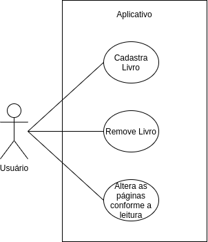
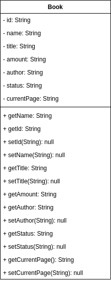

### Demonstração

### Caso de Uso

##### O usuário deve ser capaz de adicionar livro a sua biblioteca, remover livro e conforme sua leitura for avançando fazer o controle de qual página ele parou, para que assim em outra oportunidade possa continuar da exata página que parou.

